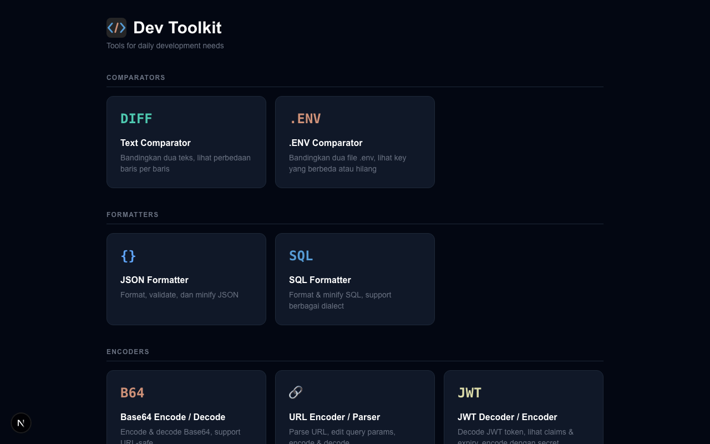

# Dev Toolkit

Personal browser-based toolkit for daily development needs. Built with Next.js, runs locally or over LAN.



## Tools

**Comparators**

| Tool | Route | Description |
|---|---|---|
| Text Comparator | `/text-comparator` | Line-by-line diff with added/removed/unchanged counts |
| .ENV Comparator | `/env-comparator` | Compare two .env files, highlight missing/different keys |

**Formatters**

| Tool | Route | Description |
|---|---|---|
| JSON Formatter | `/json-formatter` | Format, minify, sort keys, tree view, schema inference |
| SQL Formatter | `/sql-formatter` | Format/minify SQL with syntax highlighting, multi-dialect |

**Encoders**

| Tool | Route | Description |
|---|---|---|
| Base64 Encode / Decode | `/base64` | Encode/decode with URL-safe mode |
| URL Encoder / Parser | `/url-parser` | Parse URL components, edit query params, encode/decode |
| JWT Decoder / Encoder | `/jwt` | Decode JWT claims, validate expiry, encode with HMAC secret |

## Running

```bash
npm install
npm run dev      # starts on 0.0.0.0:3000 (accessible from LAN)
npm run build    # production build
```

## Stack

- Next.js 16 (App Router) + TypeScript
- Tailwind CSS v4
- Ace Editor (`react-ace`) for JSON and SQL input/output panels
- `sql-formatter` for SQL formatting
- `diff` for line-by-line text comparison
- `crypto-js` for HMAC signing (works over HTTP/LAN, unlike Web Crypto API)
